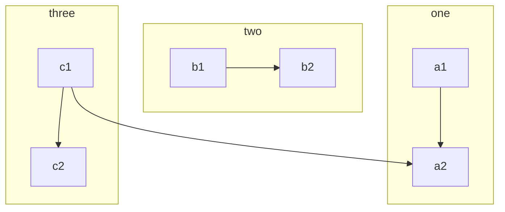
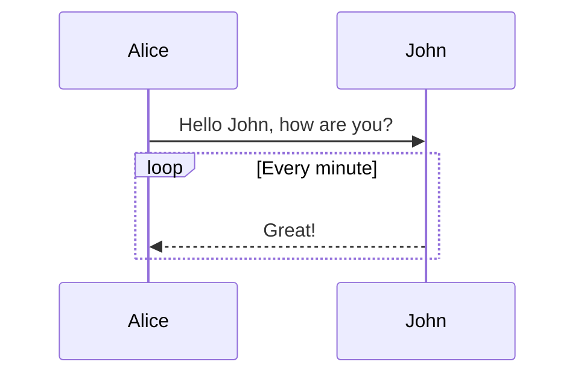
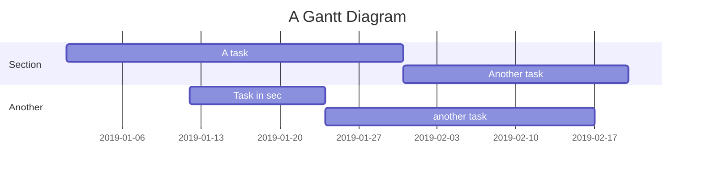
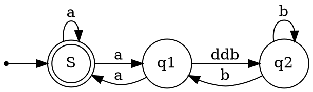

## Tutorial

This is an example of how to correctly use **Markdown** typesetting. It is necessary to learn this to make your article better and clearer.

> Quoted text: Markdown is a text formatting syntax inspired

## Syntax guide

### General content

This content shows some typeset formats in the content, such as:

-**Bold**-`**Bold**`-*Tilt*-`*Tilt*`-~~Strikethrough~~-`~~Strikethrough~~`-`Code tag`-`` `Code tag` ``-[Hyperlink](https://ld246.com)-`[Hyperlink](https://ld246.com)`-[username@gmail.com](mailto:username@gmail.com)-`[username@gmail.com](mailto:username@gmail.com)`

### Emoji Emoji

Support most standard emoticons, you can use the input method to input directly or manually input the character format. Trigger auto completion by entering `:`.

#### Some emoticons examples

:smile: :laughing: :dizzy_face: :sob: :cold_sweat: :sweat_smile: :cry: :triumph: :heart_eyes: :relieved::+1: :-1: :100: :clap: :bell: :gift: :question: :bomb: :heart: :coffee: :cyclone: :bow: :kiss: :pray: :anger:

### Heading

Use one `#` for the first-level heading, two `##` for the second-level heading, and so on, up to six-level headings are supported.

> NOTE: Don't forget # needs to have a space after it!

### Pictures

```


```

Support direct copy and paste.

### Code block

#### Ordinary

```
*emphasize* **strong**
_emphasize_ __strong__
var a = 1
```

#### Syntax highlighting support

If the language name is followed by ```, it can have the effect of syntax highlighting, for example:

##### Demonstrate Go code highlighting

```go
package main

import "fmt"

func main() {
fmt.Println("Hello, World")
}
```

##### Demo Java highlighting

```java
public class HelloWorld {

    public static void main(String[] args) {
        System.out.println("Hello World!");
    }

}
```

> Tip: Language names support the following: `ruby`, `python`, `js`, `html`, `erb`, `css`, `coffee`, `bash`, `json`, `yml`, ` xml` ...

### Ordered, unordered, task list

#### Unordered List

-Java

-Spring
-IoC
-AOP
-Go

-gofmt
-Wide
-Node.js

-Koa
-Express

#### Ordered List

1. Node.js

   1. Express
   2. Koa
   3. Sails
2. Go

   1. gofmt
   2. Wide
3. Java

   1. Latke
   2. IDEA

#### task list

-[X] Publish Sym
-[X] Release Solo
-[] Book a dentist

### Form

If you need to display data or something, you can choose to use a table.

| header 1 | header 2 |
| -------- | -------- |
| cell 1   | cell 2   |
| cell 3   | cell 4   |
| cell 5   | cell 6   |

### Paragraph

Blank lines can divide the content into sections for easy reading. (This is the first paragraph)

Using blank lines is very important in Markdown typesetting. (This is the second paragraph)

### Link reference

[Link text][Link label]

```
[Link text][link label]

[Link label]: https://b3log.org
```

### Mathematical formula

Multi-line formula block:

$$
\frac{1}{
  \Bigl(\sqrt{\phi \sqrt{5}}-\phi\Bigr) e^{
  \frac25 \pi}} = 1+\frac{e^{-2\pi}} {1+\frac{e^{-4\pi}} {
    1+\frac{e^{-6\pi}}
    {1+\frac{e^{-8\pi}}{1+\cdots}}
  }
}
$$

In-line formula:

The formula $a^2 + b^2 = \color{red}c^2$ is inline.

### Mind Map

```mindmap
- Tutorial
- Grammar guidance
  - General content
  - Mention users
  - Emoji
    - Some emoji examples
  - Heading-Heading 3
    - Heading 4
      - Heading 5
        - Heading 6
  - Picture
  - Code block
    - Normal
    - Syntax highlighting support
      - Demonstrate Go code highlighting
      - Demo Java highlighting
  - Ordered, disordered, task list
    - Unordered list
    - Ordered list
    - task list
  - Form
  - Hide details
  - Paragraph
  - Link reference
  - Mathematical formula
  - Mind Map
  - Flow chart
  - Timing diagram
  - Gantt chart
  - Chart
  - Staff
  - Graphviz
  - Multimedia
  - Footnote
  - Shortcuts
```

### Flow chart



### Timing diagram



### Gantt chart



### Chart

```echarts
{
  "title": { "text": "Latest 30 days" },
  "tooltip": { "trigger": "axis", "axisPointer": { "lineStyle": { "width": 0 } } },
  "legend": { "data": ["Articles", "Users", "Replies"] },
  "xAxis": [{
      "type": "category",
      "boundaryGap": false,
      "data": ["2019-05-08","2019-05-09","2019-05-10","2019-05-11","2019-05-12","2019-05-13","2019-05-14","2019-05-15","2019-05-16","2019-05-17","2019-05-18","2019-05-19","2019-05-20","2019-05-21","2019-05-22","2019-05-23","2019-05-24","2019-05-25","2019-05-26","2019-05-27","2019-05-28","2019-05-29","2019-05-30","2019-05-31","2019-06-01","2019-06-02","2019-06-03","2019-06-04","2019-06-05","2019-06-06","2019-06-07"],
      "axisTick": { "show": false },
      "axisLine": { "show": false }
  }],
  "yAxis": [{ "type": "value", "axisTick": { "show": false }, "axisLine": { "show": false }, "splitLine": { "lineStyle": { "color": "rgba(0, 0, 0, .38)", "type": "dashed" } } }],
  "series": [
    {
      "name": "Articles", "type": "line", "smooth": true, "itemStyle": { "color": "#d23f31" }, "areaStyle": { "normal": {} }, "z": 3,
      "data": ["18","14","22","9","7","18","10","12","13","16","6","9","15","15","12","15","8","14","9","10","29","22","14","22","9","10","15","9","9","15","0"]
    },
    {
      "name": "Users", "type": "line", "smooth": true, "itemStyle": { "color": "#f1e05a" }, "areaStyle": { "normal": {} }, "z": 2,
      "data": ["31","33","30","23","16","29","23","37","41","29","16","13","39","23","38","136","89","35","22","50","57","47","36","59","14","23","46","44","51","43","0"]
    },
    {
      "name": "Replies", "type": "line", "smooth": true, "itemStyle": { "color": "#4285f4" }, "areaStyle": { "normal": {} }, "z": 1,
      "data": ["35","42","73","15","43","58","55","35","46","87","36","15","44","76","130","73","50","20","21","54","48","73","60","89","26","27","70","63","55","37","0"]
    }
  ]
}
```

### Staff

```abc
X: 24
T: Clouds Thicken
C: Paul Rosen
S: Copyright 2005, Paul Rosen
M: 6/8
L: 1/8
Q: 3/8=116
R: Creepy Jig
K: Em
|:"Em"EEE E2G|"C7"_B2A G2F|"Em"EEE E2G|\
"C7"_B2A "B7"=B3|"Em"EEE E2G|
"C7"_B2A G2F|"Em"GFE "D (Bm7)"F2D|\
1"Em"E3-E3:|2"Em"E3-E2B|:"Em"e2e gfe|
"G"g2ab3|"Em"gfeg2e|"D"fedB2A|"Em"e2e gfe|\
"G"g2ab3|"Em"gfe"D"f2d|"Em"e3-e3:|
```

### Graphviz



### Flowchart

```flowchart
st=>start: Start
op=>operation: Your Operation
cond=>condition: Yes or No?
e=>end

st->op->cond
cond(yes)->e
cond(no)->op
```

### Content block

The syntax of the content block is an extension of Markdown by SiYuan.

### Content block reference

`((20200924101312-jj4e0v3 "Content block reference"))`

((20200924101312-jj4e0v3 "Content block reference"))

### Content block embedding

`!((20200924101312-385dey5 "Content block embedding"))`

!((20200924101312-385dey5 "Content block embedding"))

#### Super block

```markdown
{{{
content blocks
...
}}}
```

## Shortcuts

Our editor supports many shortcut keys, please refer to ((20200924100950-9op5xi1 "Editor and shortcuts")) for details.


{: id="20200924093441-ft2rhps" type="doc"}
