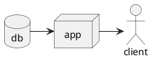

## Tutorial
{: id="20210104091509-p9osn32"}

This is an example of how to correctly use **Markdown** typesetting. It is necessary to learn this to make your article better and clearer.
{: id="20210104091509-kcv33qk" updated="20210302223827"}

> Quoted text: Markdown is a text formatting syntax inspired
> {: id="20210104091509-qnj7r6k"}
{: id="20210104091509-mqesdiy"}

## Syntax guide
{: id="20210104091509-e9ripro"}

### General content
{: id="20210104091509-sg4pt12"}

This content shows some typeset formats in the content, such as:
{: id="20210104091509-2g40nhk"}

* {: id="20210206214931-w9oisat"}**Bold** - `**Bold**`
  {: id="20210206214931-1sh9b0l"}
* {: id="20210206215019-e5bni0p"}*Tilt* - `*Tilt*`
  {: id="20210206215019-gvr3fcc"}
* {: id="20210206215025-g8xa9oy"}~~Strikethrough~~ - `~~Strikethrough~~`
  {: id="20210206215025-4eeazmc"}
* {: id="20210206215033-chf0vtc"}`Code tag` - `` `Code tag` ``
  {: id="20210206215033-q33tp81"}
* {: id="20210206215048-zg5vnou"}[Hyperlink](https://ld246.com) - `[Hyperlink](https://ld246.com)`
  {: id="20210206215048-elufsn1"}
* {: id="20210206215058-7aprsk1"}[username@gmail.com](mailto:username@gmail.com) - `[username@gmail.com](mailto:username@gmail.com)`
  {: id="20210206215058-hx2qm5x"}
{: id="20210104091509-8csaq4j"}

### Emoji Emoji
{: id="20210104091509-hdc3l4b"}

Support most standard emoticons, you can use the input method to input directly or manually input the character format. Trigger auto completion by entering `:`.
{: id="20210104091509-o778oe1"}

#### Some emoticons examples
{: id="20210104091509-nr161zw"}

:smile: :laughing: :dizzy_face: :sob: :cold_sweat: :sweat_smile: :cry: :triumph: :heart_eyes: :relieved::+1: :-1: :100: :clap: :bell: :gift: :question: :bomb: :heart: :coffee: :cyclone: :bow: :kiss: :pray: :anger:
{: id="20210104091509-s9tt7p4"}

### Heading
{: id="20210104091509-23f3041"}

Use one `#` for the first-level heading, two `##` for the second-level heading, and so on, up to six-level headings are supported.
{: id="20210104091509-cboa9lo"}

> NOTE: Don't forget # needs to have a space after it!
> {: id="20210104091509-01p1e41"}
{: id="20210104091509-q8kvnk3"}

### Pictures
{: id="20210104091509-xzmngg2"}

```


```
{: id="20210104091509-9nctgxg"}

Support direct copy and paste.
{: id="20210104091509-dpejxes"}

### Code block
{: id="20210104091509-606oli4"}

#### Ordinary
{: id="20210104091509-xmjh8gb"}

```
*emphasize* **strong**
_emphasize_ __strong__
var a = 1
```
{: id="20210104091509-pgq8nyo"}

#### Syntax highlighting support
{: id="20210104091509-5wdau5k"}

If the language name is followed by ```, it can have the effect of syntax highlighting, for example:
{: id="20210104091509-wae7knn"}

##### Demonstrate Go code highlighting
{: id="20210104091509-v2agp4t"}

```go
package main

import "fmt"

func main() {
fmt.Println("Hello, World")
}
```
{: id="20210104091509-7jdx2zj"}

##### Demo Java highlighting
{: id="20210104091509-yzs0dlz"}

```java
public class HelloWorld {

    public static void main(String[] args) {
        System.out.println("Hello World!");
    }

}
```
{: id="20210104091509-686b9xi"}

> Tip: Language names support the following: `ruby`, `python`, `js`, `html`, `erb`, `css`, `coffee`, `bash`, `json`, `yml`, ` xml` ...
> {: id="20210104091509-ozjt2fc"}
{: id="20210104091509-3a5p9xt"}

### Ordered, unordered, task list
{: id="20210104091509-6uxwbx1"}

#### Unordered List
{: id="20210104091509-dyshnes"}

-Java
{: id="20210104091509-4361ij9"}

-Spring
-IoC
-AOP
-Go
{: id="20210104091509-lpyprpg"}

-gofmt
-Wide
-Node.js
{: id="20210104091509-qowv53y"}

-Koa
-Express
{: id="20210104091509-atai4lp"}

#### Ordered List
{: id="20210104091509-6vdzi1s"}

1. {: id="20210104091509-uoj0v4u"}Node.js
   {: id="20210104091509-466uqpv"}

   1. {: id="20210104091509-7f27hw2"}Express
      {: id="20210201203340-ww6edm7"}
   2. {: id="20210104091509-9nn3xgv"}Koa
      {: id="20210201203340-3d47swl"}
   3. {: id="20210104091509-ththxjo"}Sails
      {: id="20210201203340-pu8imaz"}
   {: id="20210104091509-tz6b667"}
2. {: id="20210104091509-q2i8lew"}Go
   {: id="20210104091509-a4qoj4e"}

   1. {: id="20210104091509-9nnoi3q"}gofmt
      {: id="20210201203340-aqoyzlw"}
   2. {: id="20210104091509-isoqrw3"}Wide
      {: id="20210201203340-fpw52jv"}
   {: id="20210104091509-bwtgbgh"}
3. {: id="20210104091509-46ksbxh"}Java
   {: id="20210104091509-ys7x4p9"}

   1. {: id="20210104091509-hwzgjv7"}Latke
      {: id="20210201203340-10fwtz7"}
   2. {: id="20210104091509-x6gh9pt"}IDEA
      {: id="20210201203340-iadta7n"}
   {: id="20210104091509-epzcxbq"}
{: id="20210104091509-14bo3es"}

#### task list
{: id="20210104091509-lgi6kq5"}

-[X] Publish Sym
-[X] Release Solo
-[] Book a dentist
{: id="20210104091509-uossxkc"}

### Form
{: id="20210104091509-qr9enpx"}

If you need to display data or something, you can choose to use a table.
{: id="20210104091509-ni6g1rn"}

| header 1 | header 2 |
| ---------- | ---------- |
| cell 1   | cell 2   |
| cell 3   | cell 4   |
| cell 5   | cell 6   |
{: id="20210104091509-kjhoeyo"}

### Paragraph
{: id="20210104091509-vcbuim6"}

Blank lines can divide the content into sections for easy reading. (This is the first paragraph)
{: id="20210104091509-ljoi275"}

Using blank lines is very important in Markdown typesetting. (This is the second paragraph)
{: id="20210104091509-j9suugh"}

### Link reference
{: id="20210104091509-6a6yqod"}

[Link text][Link label]
{: id="20210104091509-2d1xbap"}

```
[Link text][link label]

[Link label]: https://b3log.org
```
{: id="20210104091509-9dupsx7"}

### Mathematical formula
{: id="20210104091509-5te4mca"}

Multi-line formula block:
{: id="20210104091509-wvfqjwl"}

$$
\frac{1}{
  \Bigl(\sqrt{\phi \sqrt{5}}-\phi\Bigr) e^{
  \frac25 \pi}} = 1+\frac{e^{-2\pi}} {1+\frac{e^{-4\pi}} {
    1+\frac{e^{-6\pi}}
    {1+\frac{e^{-8\pi}}{1+\cdots}}
  }
}
$$
{: id="20210104091509-oizpd0y"}

In-line formula:
{: id="20210104091509-a5y3bhl"}

The formula $a^2 + b^2 = \color{red}c^2$ is inline.
{: id="20210104091509-hit6ffz"}

### Mind Map
{: id="20210104091509-v1x69oc"}

```mindmap
- Tutorial
- Grammar guidance
  - General content
  - Mention users
  - Emoji
    - Some emoji examples
  - Heading-Heading 3
    - Heading 4
      - Heading 5
        - Heading 6
  - Picture
  - Code block
    - Normal
    - Syntax highlighting support
      - Demonstrate Go code highlighting
      - Demo Java highlighting
  - Ordered, disordered, task list
    - Unordered list
    - Ordered list
    - task list
  - Form
  - Hide details
  - Paragraph
  - Link reference
  - Mathematical formula
  - Mind Map
  - Flow chart
  - Timing diagram
  - Gantt chart
  - Chart
  - Staff
  - Graphviz
  - Multimedia
  - Footnote
  - Shortcuts
```
{: id="20210104091509-ilh76fd"}

### Flow chart
{: id="20210104091509-oihpzcz"}


{: id="20210104091509-viqif92"}

### Timing diagram
{: id="20210104091509-fim1ztl"}


{: id="20210104091509-mwfs4sw"}

### Gantt chart
{: id="20210104091509-gjag91d"}


{: id="20210104091509-ki9cxs7"}

### Chart
{: id="20210104091509-hlh01sn"}

```echarts
{
  "title": { "text": "Latest 30 days" },
  "tooltip": { "trigger": "axis", "axisPointer": { "lineStyle": { "width": 0 } } },
  "legend": { "data": ["Articles", "Users", "Replies"] },
  "xAxis": [{
      "type": "category",
      "boundaryGap": false,
      "data": ["2019-05-08","2019-05-09","2019-05-10","2019-05-11","2019-05-12","2019-05-13","2019-05-14","2019-05-15","2019-05-16","2019-05-17","2019-05-18","2019-05-19","2019-05-20","2019-05-21","2019-05-22","2019-05-23","2019-05-24","2019-05-25","2019-05-26","2019-05-27","2019-05-28","2019-05-29","2019-05-30","2019-05-31","2019-06-01","2019-06-02","2019-06-03","2019-06-04","2019-06-05","2019-06-06","2019-06-07"],
      "axisTick": { "show": false },
      "axisLine": { "show": false }
  }],
  "yAxis": [{ "type": "value", "axisTick": { "show": false }, "axisLine": { "show": false }, "splitLine": { "lineStyle": { "color": "rgba(0, 0, 0, .38)", "type": "dashed" } } }],
  "series": [
    {
      "name": "Articles", "type": "line", "smooth": true, "itemStyle": { "color": "#d23f31" }, "areaStyle": { "normal": {} }, "z": 3,
      "data": ["18","14","22","9","7","18","10","12","13","16","6","9","15","15","12","15","8","14","9","10","29","22","14","22","9","10","15","9","9","15","0"]
    },
    {
      "name": "Users", "type": "line", "smooth": true, "itemStyle": { "color": "#f1e05a" }, "areaStyle": { "normal": {} }, "z": 2,
      "data": ["31","33","30","23","16","29","23","37","41","29","16","13","39","23","38","136","89","35","22","50","57","47","36","59","14","23","46","44","51","43","0"]
    },
    {
      "name": "Replies", "type": "line", "smooth": true, "itemStyle": { "color": "#4285f4" }, "areaStyle": { "normal": {} }, "z": 1,
      "data": ["35","42","73","15","43","58","55","35","46","87","36","15","44","76","130","73","50","20","21","54","48","73","60","89","26","27","70","63","55","37","0"]
    }
  ]
}
```
{: id="20210104091509-2kh9v50"}

### Staff
{: id="20210104091509-j6xq9xm"}

```abc
X: 24
T: Clouds Thicken
C: Paul Rosen
S: Copyright 2005, Paul Rosen
M: 6/8
L: 1/8
Q: 3/8=116
R: Creepy Jig
K: Em
|:"Em"EEE E2G|"C7"_B2A G2F|"Em"EEE E2G|\
"C7"_B2A "B7"=B3|"Em"EEE E2G|
"C7"_B2A G2F|"Em"GFE "D (Bm7)"F2D|\
1"Em"E3-E3:|2"Em"E3-E2B|:"Em"e2e gfe|
"G"g2ab3|"Em"gfeg2e|"D"fedB2A|"Em"e2e gfe|\
"G"g2ab3|"Em"gfe"D"f2d|"Em"e3-e3:|
```
{: id="20210104091509-d5oimqr"}

### Graphviz
{: id="20210104091509-p75cyqy"}


{: id="20210104091509-5oabbxe"}

### Flowchart
{: id="20210104091509-3e348ea"}

```flowchart
st=>start: Start
op=>operation: Your Operation
cond=>condition: Yes or No?
e=>end

st->op->cond
cond(yes)->e
cond(no)->op
```
{: id="20210104091509-u0vtq1c"}

### PlantUML
{: id="20210201203412-n26xya3"}


{: id="20210201203424-ohqom70"}

### Content block
{: id="20210104091509-alp29j5"}

The syntax of the content block is an extension of Markdown by SiYuan.
{: id="20210104091509-cahkz6m"}

### Content block reference
{: id="20210104091509-60dpmax"}

`((20200924101312-jj4e0v3 "Content block reference"))`
{: id="20210104091509-jral852"}

((20200924101312-jj4e0v3 "Content block reference"))
{: id="20210104091509-33x9nv5"}

### Content block embedding
{: id="20210104091509-z5exdte"}

`!((20200924101312-385dey5 "Content block embedding"))`
{: id="20210104091509-smzo1ig"}

!((20200924101312-385dey5 "Content block embedding"))
{: id="20210104091509-wncua57"}

#### Super block
{: id="20210104091509-doo27sv"}

```markdown
{{{
content blocks
...
}}}
```
{: id="20210104091509-80lo43a"}

## Shortcuts
{: id="20210104091509-lwkktkk"}

Our editor supports many shortcut keys, please refer to ((20200924100950-9op5xi1 "Editor and shortcuts")) for details.
{: id="20210104091509-cgpdghn"}


{: id="20200924093441-ft2rhps" type="doc"}
